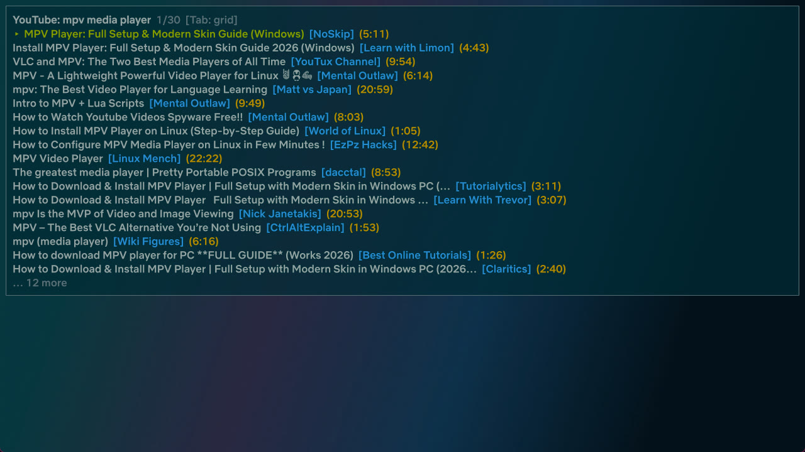
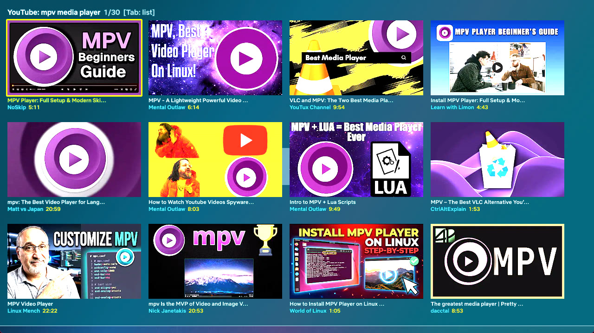

<p align="center"></p>

# mpv echo-HC edition

A fork of [Echo-Storm's MPV-Nvidia-VSR](https://github.com/Echo-Storm/MPV-Nvidia-VSR) config with a built-in browser for YouTube, Twitch and anime, retuned for a 240 Hz HDR display.

## 🧠 Overview

This setup is built for users who have Nvidia RTX Video Super Resolution (VSR) enabled in the Nvidia app. It includes:

- A streamlined `mpv.conf` for modern GPUs (`vo=gpu-next`, `gpu-api=d3d11`, `hwdec=d3d11va-copy`)
- **Browse inside mpv:** YouTube search plus your Subscriptions, Home, History and Watch Later feeds, Twitch search plus a live-channel list, and a torrent index of your choosing (search, new releases, followed shows) streamed in memory. List or thumbnail-grid view, type to fuzzy-filter, mouse or keyboard (`browse.lua`)
- A custom Lua script that triggers VSR after 3 seconds of playback, auto-crops black bars, and upscales to native resolution — the two are integrated in one script so crop coordinates and VSR's scale factor never disagree (`vsr_autocrop.lua`)
- GLSL shader profiles (ArtCNN, NNEDI3, RAVU, FSRCNNX, Anime4K) that take over from VSR where they apply; anime WEB-DL releases get ArtCNN automatically
- HDR passthrough per display, SDR→HDR via libplacebo inverse tone mapping
- ModernZ as the single OSC, mpv's native right-click menu, built-in `select.lua` for playlist, track and chapter pickers
- Fully portable structure with optional system integration; no admin required

---

## 📸 Screenshots

<table>
<tr>
<td width="50%">

<p align="center"><sub><b>Player</b> — ModernZ OSC</sub></p>
</td>
<td width="50%">

<p align="center"><sub><b>Right-click menu</b> — mpv's native <code>menu.conf</code> menu</sub></p>
</td>
</tr>
<tr>
<td width="50%">

<p align="center"><sub><b>Browse</b> — YouTube search, list view (<code>Ctrl+y</code>)</sub></p>
</td>
<td width="50%">

<p align="center"><sub><b>Browse</b> — same results, thumbnail grid (<code>Tab</code>)</sub></p>
</td>
</tr>
</table>

---

## ⚙️ Installation & Usage

### ✅ To install:

1. **Run `1_Full_Latest_MPV_Installer.ps1`**
   - Installs the latest versions of MPV, FFmpeg, yt-dlp, and guessit (used by `autochapters`)
   - Fully portable, no admin required

2. **Run `2_Add_Supported_Filetypes_To_Open_With.ps1`** *(optional)*
   - Adds MPV to system PATH
   - Registers MPV for "Open With" with common media formats
   - Requires admin, will auto-detect and prompt

3. **Add login cookies** *(optional, needed for Twitch 1440p and the YouTube account feeds)*

   `mpv.conf` points yt-dlp at `yt-dlp-cookies.txt` in the install root (next to `mpv.exe`). The file is gitignored and never leaves your machine. Without it everything still works: Twitch tops out at 1080p60 and the YouTube Subscriptions/Home/History/Watch Later entries return nothing.

   1. Install a Netscape-format cookie exporter in your browser, e.g. [Get cookies.txt LOCALLY](https://github.com/kairi003/Get-cookies.txt-LOCALLY).
   2. **Twitch:** in a normal window, logged in, open twitch.tv and export the cookies for that site. The `auth-token` cookie does not rotate; re-export only after you log out of Twitch in the browser.
   3. **YouTube:** open a **private window**, log in, go to `https://www.youtube.com/robots.txt`, export the cookies for youtube.com, then **close the private window**. YouTube rotates account cookies on open tabs; cookies taken from your normal browser session stop working within minutes and yt-dlp reports "The provided YouTube account cookies are no longer valid".
   4. Paste both exports into one file, `yt-dlp-cookies.txt`, in the install root. yt-dlp rewrites it after every run, that is expected.

   Do **not** use `cookies-from-browser`. yt-dlp writes the merged jar back to the file, which dumps every cookie your browser holds into plain text.

4. **Point the Torrents source at an index** *(optional, for anime)*

   The repo ships no torrent site. Paste your index's two RSS URLs into `portable_config/script-opts/browse.conf`; until both are set, `Open > Torrents` is hidden and its bindings say what to configure. Most indexes offer an RSS version of their search page; `{query}` is replaced with the URL-encoded search text:

   ```ini
   torrent_search_url=https://index.example/?page=rss&q={query}&c=1_2
   torrent_new_url=https://index.example/?page=rss&c=1_2
   torrent_shows=Sousou no Frieren|SubsPlease,Dandadan
   ```

   `torrent_shows` is the follow list (comma-separated search strings, an optional `|Group` suffix keeps only that release group's uploads). Playback needs Node.js on `PATH` (`node --version`); the first release will trigger a Windows Firewall prompt for `node.exe`. Nothing is written to disk: `script-opts/webtorrent.conf` runs the client in memory mode.

### 🛠️ To change settings without hand-editing config files:

- **Run `3_Configuration_Manager.ps1`**
  - A small checkbox/dropdown/text panel for the settings you're most likely to actually flip — audio/subtitle language priority, interpolation, debanding, auto-crop, RTX Video HDR, HDR display mode, video sync, surround audio preference, the two opt-in audio fixes, chapter auto-skip, stream thumbnails, stream cache size, max stream quality, and the stream auto-reload triggers
  - Reads and rewrites only the specific lines it changes — every comment and every other setting in `mpv.conf`/`script-opts/*.conf` is left exactly where it was
  - No admin required. Changes take effect the next time mpv starts (this edits the files mpv reads at launch, it doesn't talk to a running mpv instance)
  - Renders in light mode regardless of system theme — it's a plain WPF window, which (unlike the native file-open dialog) doesn't auto-theme on Windows 11

  - Slightly out of date example:
  

### 🔄 To uninstall:

- **Run `X1_Remove_Supported_File_types_From_Open_With.ps1`**
  - Removes PATH entry, Open With registration, and filetype associations

### 🔁 To update:

- Simply run `1_Full_Latest_MPV_Installer.ps1`
- Updates MPV, FFmpeg, yt-dlp, and guessit
- No need to re-run registration scripts unless you've uninstalled

---

## 📁 Folder Structure

```
MPV/
├── 1_Full_Latest_MPV_Installer.ps1                     ← downloads mpv, ffmpeg, yt-dlp, guessit into this folder
├── 2_Add_Supported_Filetypes_To_Open_With.ps1          ← registration (PATH + Open With)
├── 3_Configuration_Manager.ps1                         ← checkbox/dropdown panel for common config toggles
├── X1_Remove_Supported_File_types_From_Open_With.ps1   ← uninstall (reverses script 2)
├── yt-dlp-cookies.txt                                  ← your login cookies, gitignored (see Installation step 3)
├── doc/
│   ├── manual.pdf
│   ├── mpbindings.png
│   ├── research-rtx-vsr-vs-shaders.md                  ← why shaders and VSR cannot stack, measured
│   └── research-osc-modernz-vs-uosc.md                 ← why ModernZ is the only OSC
├── docs/
│   ├── adr/                                            ← decision records (why things are the way they are)
│   └── testing.md                                      ← how to verify changes: synthetic clips, probes, UI driving
├── webtorrent/                                         ← bun project vendoring webtorrent-mpv-hook (+ patch for a second magnet per session)
└── portable_config/
    ├── mpv.conf
    ├── profiles.conf        ← shader, HDR, downscaling and downmix profiles
    ├── input.conf
    ├── menu.conf            ← right-click context menu (mpv default + Open File/Folder/URL, YouTube, Twitch, Torrents)
    ├── fonts/               ← Netflix Sans + ModernZ icon fonts
    ├── scripts/
    │   ├── browse.lua                    ← YouTube/Twitch/torrent-index search and feeds inside mpv (echo-HC)
    │   ├── browse_torrents.lua           ← pure Lua feed/title parsing and ordering for the Torrents source (unit test in docs/tests)
    │   ├── whichkey.lua                  ← which-key panel: press g or b to see and run the bindings under it (test in docs/tests)
    │   ├── modernz.lua                   ← OSC UI
    │   ├── vsr_autocrop.lua              ← RTX VSR upscaler + crop-aware auto-crop, one integrated script (Echostorm)
    │   ├── screenshotfolder_echostorm.lua← organized screenshots (Echostorm)
    │   ├── thumbfast.lua                 ← seekbar thumbnails
    │   ├── pause_indicator_lite.lua      ← pause overlay
    │   ├── open_file_echostorm.lua       ← native Windows open file/folder/URL/subtitle/audio dialogs (Echostorm: added folder, URL)
    │   ├── ytdlautoformat.lua            ← auto ytdl-format per domain (YouTube, Twitch, Kick)
    │   ├── chapterskip.lua               ← auto-skip OP/ED/preview chapters
    │   ├── reload.lua                    ← auto-reload stalled streams
    │   ├── hdr-mode.lua                  ← per-display HDR target, SDR→HDR inverse tone mapping
    │   ├── display-info.dll              ← mpv-display-plugin, HDR display info for hdr-mode.lua
    │   ├── prefer_surround_echostorm.lua ← auto-selects the highest-channel-count audio track (Echostorm)
    │   ├── clip_export_echostorm.lua     ← mark in/out points, export via ffmpeg stream copy (Echostorm)
    │   ├── stream_quality_echostorm.lua  ← mid-stream quality up/down for YouTube/Twitch/Kick (Echostorm)
    │   ├── autoload.lua                  ← queue the rest of the folder as a playlist
    │   ├── autodeint.lua                 ← Ctrl+d: detect interlacing and insert a deinterlacer
    │   ├── evafast.lua                   ← hold Right to fast-forward, tap to seek
    │   ├── webtorrent.js                 ← webtorrent-mpv-hook: streams magnet links in memory (symlink into webtorrent/, needs node on PATH)
    │   └── autochapters/main.lua         ← auto-detect anime OP/ED chapters (needs guessit.exe, see below)
    ├── script-opts/                      ← one .conf per script above; browse.conf holds the Twitch channel list and the torrent index URLs, webtorrent.conf the memory-mode client
    └── shaders/                          ← ArtCNN C4F16, NNEDI3, RAVU, FSRCNNX, Anime4K, SSIM (only d3d11-compatible builds)
```

---

## 🎯 Features

- **Browse YouTube and Twitch without leaving mpv:** `Ctrl+y` searches YouTube, `Ctrl+t` searches Twitch; the right-click `Open` menu adds YouTube Subscriptions / Home / History / Watch later and Twitch Live channels. Results open in a Solarized Dark list (18 rows) or a 4x3 thumbnail grid, `Tab` toggles. Type to fuzzy-filter, arrows / PgUp / PgDn / Home / End / mouse wheel to move, hover to focus, `Enter` or click to play, `Esc` clears the filter then closes. Feeds and the 1440p Twitch rendition need login cookies (Installation step 3). Twitch does not expose the follow list to third-party clients, so `Live channels` checks the logins you list in `script-opts/browse.conf` under `twitch_channels=`
- **Anime from a torrent index, streamed like YouTube:** `Open > Torrents` (Search..., New releases, Followed shows) queries the RSS feeds you configured (Installation step 4) and lists releases grouped by show, newest episode first, then highest resolution, then most seeders; releases with fewer than 3 seeders sink to the bottom of their show and titles the parser cannot read land in a final unparsed group. Each row shows seeders, size and a `trusted` marker; the grid shows one cover per show from AniList, cached with the thumbnails. `Enter` hands the release to `webtorrent.js`, which streams it in memory (a season batch loads as a playlist starting at the first file), and picking another release stops the first transfer and starts the next. `Ctrl+Shift+t` toggles the transfer overlay (speed, peers, progress)
- **Watch history:** mpv's built-in `save-watch-history` records everything played; YouTube videos are also marked watched on your account when cookies are present
- **Configuration Manager:** `3_Configuration_Manager.ps1` — a standalone checkbox/dropdown/text panel (including audio/subtitle language priority) for the settings worth flipping without opening a config file by hand, editing only the specific lines it changes. See Installation & Usage above
- **Base UI:** ModernZ v0.3.3 with fluent icon theme, the only OSC. See `doc/research-osc-modernz-vs-uosc.md` for why uosc was dropped
- **Shaders:** `profiles.conf` ships `ArtCNN`, `ArtCNN-DS`, `NNEDI3`, `NNEDI3+`, `Ravu-Zoom`, `FSRCNNX`, `FSRCNNX+`, `Anime4K` and two deband strengths, selectable with `--profile=` or from the right-click `Profiles` menu. Anime WEB-DL releases (SubsPlease, Erai-raws, HorribleSubs, HatSubs filenames) get `ArtCNN_C4F16_DS` automatically. When a shader is active `vsr_autocrop.lua` skips VSR: they cannot stack, d3d11's video processor scales before any shader runs (`doc/research-rtx-vsr-vs-shaders.md`)
- **Fonts:** Netflix Sans Medium (default), with Light and Bold variants
- **Upscaling:** RTX VSR activates ~4 seconds after playback starts (3s hwdec settle + 1s crop detection), auto-upscales to native resolution — only applies when the *cropped* video content is below display resolution and hardware decoded (`vsr_autocrop.lua`)
- **Interactive menus:** Built-in `select.lua` (mpv 0.40+) wired to playlist, audio track, subtitle, chapter, and audio device buttons
- **Thumbnails:** thumbfast enabled including network/stream sources
- **Screenshots:** Auto-organized into `Desktop/mpv/screenshots/{title}/`, timestamped, JPG
- **Audio normalization:** `dynaudnorm` available via `af=` in `mpv.conf` (commented out by default — uncomment to enable)
- **Network buffering:** Cache and readahead configured for HLS/live stream stability
- **UI:** Borders enabled, windowed by default, taskbar progress enabled
- **File dialogs:** `Ctrl+O` opens files, `Ctrl+Shift+O` opens a folder, `Ctrl+U` opens a URL, `Ctrl+Shift+S` adds a subtitle, `Ctrl+Shift+A` adds an audio track — all via native Windows dialogs, also reachable from the right-click menu
- **Right-click menu:** mpv's full default context menu (`menu.conf`) — playback, tracks, video/audio/subtitle controls, window, tools, etc. — plus Open File/Folder/Subtitle/Audio at the top of the Open submenu, and runtime toggles for crop, auto-crop mode, chapter-skip, and HDR mode (see below)
- **Stream quality:** `ytdl-format` auto-adjusts for YouTube, Twitch, and Kick (2160p cap by default, `quality=` in `ytdlautoformat.conf`), leaving other sites on `mpv.conf`'s default — lower the cap and RTX VSR upscales the rest. Bump it up/down mid-stream from the right-click Playback menu (`stream_quality_echostorm.lua`) — reloads at the current position with the new cap, since yt-dlp only reads `ytdl-format` at load time
- **Auto-crop:** black bars auto-detected and cropped as part of the same evaluation that decides VSR's scale factor (`vsr_autocrop.lua`, see Changelog for why these can't be separate scripts). `c` toggles/undoes the current crop+VSR state manually (`C`, uppercase, is taken by the aspect-ratio cycle); auto-crop mode itself can be toggled from the right-click `&Video` menu
- **Motion interpolation:** off by default (`interpolation=no`), toggle from the right-click `&Video` menu — smooths judder on lower-framerate content at the cost of some GPU overhead
- **Chapter skip:** opening, ending, and next-episode preview chapters auto-skipped when present — toggle from the right-click `&Chapters` menu
- **Auto chapters:** missing OP/ED chapters looked up automatically for anime files (requires `guessit.exe`, installed automatically by script 1 — or downloaded manually from [guessit-io/guessit releases](https://github.com/guessit-io/guessit/releases) and dropped in the install root; and `curl`, built into Windows 10/11) — manual search/database-update also in the right-click `&Chapters` menu
- **Stream auto-reload:** a stalled/dead network stream automatically reloads from its last position (`Ctrl+R` to trigger manually, also in the right-click Playback menu)
- **HDR:** [mpv-display-plugin](https://github.com/dyphire/mpv-display-plugin) (`scripts/display-info.dll`) provides display HDR capability info to `hdr-mode.lua`. Defaults to `hdr_mode=pass` (passes HDR through when the display is already in HDR mode; no automatic OS-level HDR switching, no flicker risk). Cycle `noth`/`switch`/`pass` from the right-click `&Window` menu. In pass mode SDR sources are inverse tone mapped by libplacebo to the display's measured peak (`inverse-tone-mapping=yes`), so SDR content uses the HDR headroom without the NVIDIA filter
- **Debanding** on by default (`deband=yes`, one iteration), `d` toggles
- **NVIDIA RTX Video HDR:** optional SDR→HDR enhancement, off by default (`nvidia_true_hdr=no` in `vsr_autocrop.conf`) — toggle from the right-click `&Window` menu. Only ever applies when the display is confirmed already in HDR mode (via the same `mpv-display-plugin` info `hdr-mode.lua` uses), so it can't misfire on an SDR display the way mpv's own filter can on its own (see Troubleshooting). Requires mpv 0.40+ and RTX Video HDR enabled in the NVIDIA app
- **Surround audio preferred automatically:** on file load, auto-selects whichever audio track reports the highest channel count, but only among tracks matching whatever language `alang` already resolved to — never overrides a language preference just for more channels (`prefer_surround_echostorm.lua`) — mpv's own `--aid=auto` has no channel-count preference and can land on a lesser stereo/mono track when multiple tracks are ambiguously flagged "default" in the container
- **Clip export:** mark an in/out point during playback and export that range via bundled `ffmpeg.exe` as a lossless stream-copy clip (`clip_export_echostorm.lua`), saved to `Desktop/mpv/clips/` — reachable from the right-click `Tools` → `Clip export` submenu. Cut points snap to the nearest keyframe (a stream-copy limitation, not a bug) — re-encode afterwards in a real editor if frame-accurate cuts are needed

---

## 📌 Notes

- All scripts are silent, reversible, and require no user input except to exit
- Designed for Windows 10/11 with PowerShell 3+ (written for 7)
- No registry bloat, no filetype hijacking, no start menu shortcuts
- Requires mpv 0.40+ for `select.lua` interactive menus (`load-select=yes`, mpv's actual default — `load-select-ui` was never a real option, see v1.0.3 changelog)
- RTX VSR requires `gpu-api=d3d11` and an Nvidia RTX card with VSR enabled in the Nvidia app
- Tuned on an RTX 3080 Ti driving a 3440x1440 240 Hz HDR display. `video-sync=audio` rather than `display-resample`: every display-sync mode dropped frames on 4K HDR at 240 Hz in testing, audio sync dropped none

---

## 🔧 Troubleshooting

- **Audio cuts out, drops, or goes silent for a moment right after seeking, unpausing, or skipping to the next track/file.** Known issue with older or budget HDMI A/V receivers (AVRs) / soundbars that ignore or drop the first bit of audio every time HDMI audio output stops and restarts. Fix: uncomment `audio-stream-silence=yes` in `mpv.conf` (commented out by default since v1.0.12 — mpv's own manual calls it "strongly discouraged" since it changes A/V-sync and underrun handling for every file, so it's opt-in rather than on by default now).
- **Audio is too loud/quiet, or inconsistent between quiet and loud scenes/streams.** Uncomment `af=lavfi=[dynaudnorm=f=150:g=15:p=0.95]` in `mpv.conf` (commented out by default) — a single-pass, live-stream-safe loudness normalizer. Unlike `loudnorm`, it doesn't need to buffer the whole file first, so it's safe for live/HLS streams too.
- **Kick.com videos won't load / fail to fetch metadata.** Confirmed to be [yt-dlp#17284](https://github.com/yt-dlp/yt-dlp/issues/17284), an open upstream bug — Kick changed something site-side that broke yt-dlp's extractor (VODs, Live, and Clips all affected). Not a config issue here; should resolve itself once yt-dlp ships a fix. Re-run `1_Full_Latest_MPV_Installer.ps1` periodically to pick up new yt-dlp versions.
- **`autochapters` warns "couldn't parse media filename, is guessit installed?"** Needs `guessit.exe` in the install root — `1_Full_Latest_MPV_Installer.ps1` downloads this automatically; if you installed before that was added, just re-run the installer.
- **HDR isn't switching/passing through.** `hdr-mode.lua` needs the companion [mpv-display-plugin](https://github.com/dyphire/mpv-display-plugin) (`scripts/display-info.dll`) for display capability info — without it, `hdr_mode` has nothing to act on.
- **Enabled `nvidia_true_hdr` but nothing changes.** Needs mpv 0.40+, RTX Video HDR enabled in the NVIDIA app, an SDR (8-bit) source, and the display already in HDR mode — `vsr_autocrop.lua` checks that last part itself via `mpv-display-plugin` before applying anything, since mpv's own filter has no such check and can visibly misbehave on an SDR display ([mpv#17800](https://github.com/mpv-player/mpv/issues/17800)). If the plugin isn't installed, this option is silently a permanent no-op.
- **The Open Folder / Open URL dialogs look light-mode even in a dark theme.** Expected — both use legacy pre-Vista Windows APIs (`Shell.Application.BrowseForFolder`, VB.NET's `InputBox`) that predate dark mode and were never retrofitted for it. Open File/Add Subtitle/Add Audio use the modern dialog, which does follow system theme automatically.
- **Configuration Manager is light-mode even in a dark theme.** Same underlying reason as above, different cause: it's a plain WPF window, and WPF (unlike the modern `IFileDialog`-based open/subtitle/audio pickers) doesn't auto-theme on Windows 11 without custom styling work. Cosmetic only.
- **Changed a setting in Configuration Manager but nothing's different.** Expected if mpv was already running — it edits the config files mpv reads at launch, not a running instance. Restart mpv (or launch it fresh) to pick up the change.
- **Twitch plays at 1080p, not 1440p.** Twitch only serves the 1440p60 "Source" rendition to logged-in accounts. Either `yt-dlp-cookies.txt` is missing, or you logged out of Twitch in the browser and the `auth-token` cookie died with the session. Re-export the twitch.tv cookies (Installation step 3) and merge them into the file. To confirm: `yt-dlp.exe --cookies yt-dlp-cookies.txt -F https://twitch.tv/<channel>` should list a 2560x1440 HEVC format.
- **YouTube Subscriptions / History / Watch later come back empty**, or yt-dlp warns "The provided YouTube account cookies are no longer valid". The YouTube cookies were taken from a live browser session and got rotated. Re-export them from a fresh private window on `youtube.com/robots.txt`, then close that window before playing anything (Installation step 3).
- **Twitch `Live channels` shows nobody / not my follows.** Twitch's GraphQL API returns "service error" for the follow list to any third-party client; this is not fixable from our side. Fill `twitch_channels=` in `script-opts/browse.conf` with the logins you care about, comma-separated.
- **`Open > Torrents` is missing**, or a torrent binding says "set torrent_search_url=". Both index URLs in `script-opts/browse.conf` are empty (Installation step 4). "index feed failed" with a curl message means the index did not answer; "index did not return an RSS feed" means the URL is a web page, not its RSS variant.
- **Picking a release shows a black window and never plays.** The hook logs `Running WebTorrent hook` then nothing: no peers were found (check seeders in the row, try a `trusted` release), or `node.exe` is missing from `PATH` / blocked by the firewall. `Ctrl+Shift+t` shows peers and speed while it buffers.
- **A shader profile does nothing, or the log says `Too many constant buffers`.** The ArtCNN C4F32 and `_CMP` compute builds exceed d3d11's 14-cbuffer / 32 KB group-shared-memory limits and libplacebo silently disables the hook after the first frame. Only the C4F16 variants work on `gpu-api=d3d11`; do not add the larger builds unless you switch to `gpu-api=vulkan`, which loses RTX VSR.
- **4K HDR stutters / drops frames at high refresh rates.** Make sure `video-sync=audio` is still set (the Configuration Manager can switch it). `display-resample` measurably dropped frames on 2160p HDR at 240 Hz.

---

## 📋 Changelog

Full version history in [CHANGELOG.md](CHANGELOG.md). Latest:

### 2026-09-04 — echo-HC v0.03: Torrents source in browse.lua, in-memory streaming

- **`Open > Torrents`**: search, new releases and a followed-show list from a user-configured RSS index (the repo names none), grouped by show and ordered by episode / resolution / seeders, covers from AniList in the grid.
- **`webtorrent.js`** wired up in memory mode; patched so a second release in the same session replaces the first. `Ctrl+Shift+t` toggles the transfer overlay.

### 2026-09-03 — echo-HC v0.02: in-mpv YouTube/Twitch browser, login cookies, ArtCNN, 240 Hz tuning

- **`browse.lua`**: YouTube search and account feeds, Twitch search and live list, list and thumbnail-grid views, fuzzy filter, mouse support.
- **Login cookies** for yt-dlp via one `yt-dlp-cookies.txt`: Twitch 1440p Source and YouTube feeds/mark-watched. Path is portable (`~~home/../`), no absolute paths in the config.
- **Shaders**: ArtCNN C4F16 (+DS) replace the C4F32 builds, which do not compile on d3d11. Shaders take precedence over VSR.
- **Removed**: uosc, inputevent, playlistmanager, memo, exclusive fullscreen, nlmeans. ModernZ is the sole OSC.
- **`video-sync=audio`**, `deband=yes`, `inverse-tone-mapping=yes`, per-display HDR target owned by `hdr-mode.lua`.
- Repo hygiene: `.gitattributes`, installer markers and agent notes gitignored, `CLAUDE.md` + `docs/agents/` for the engineering skills.
