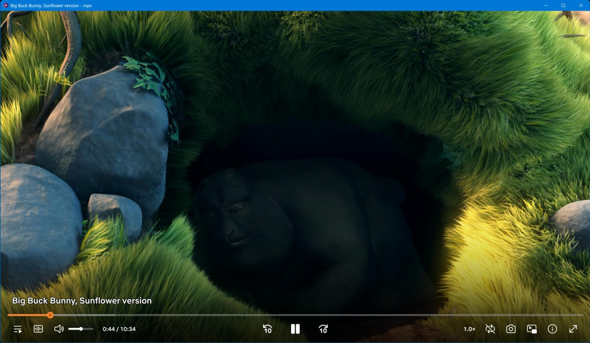
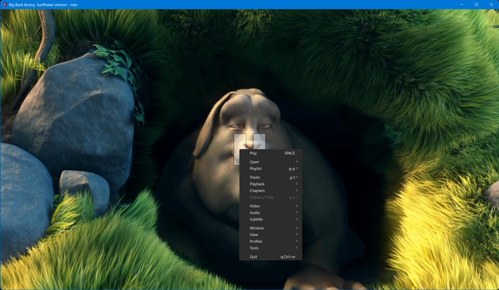
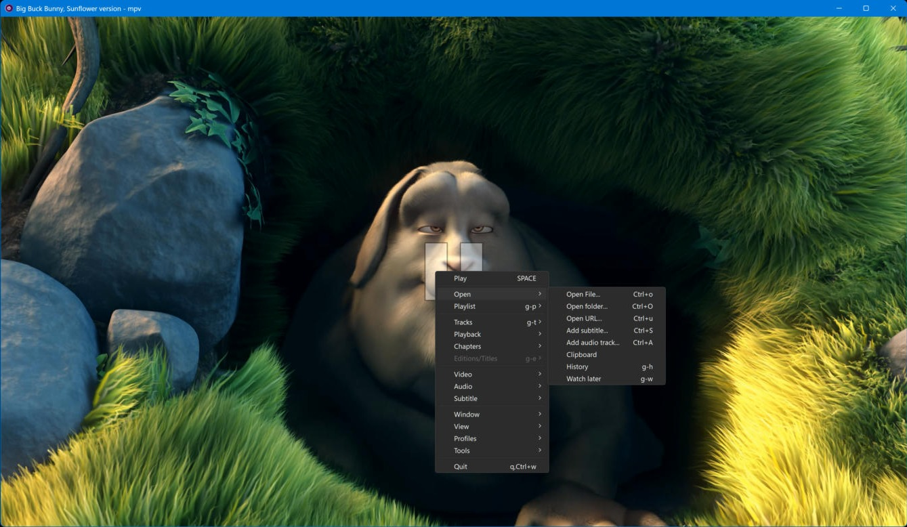
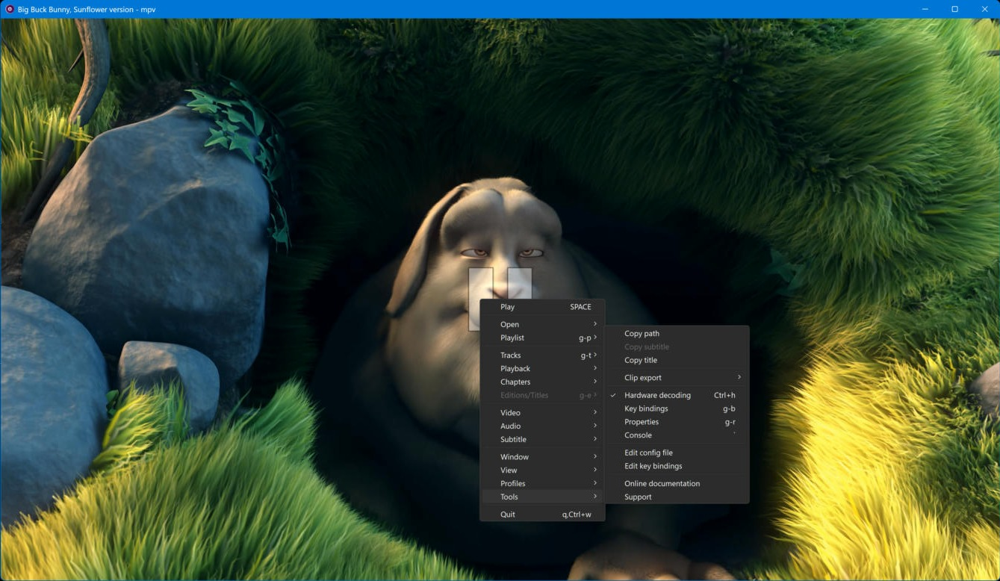
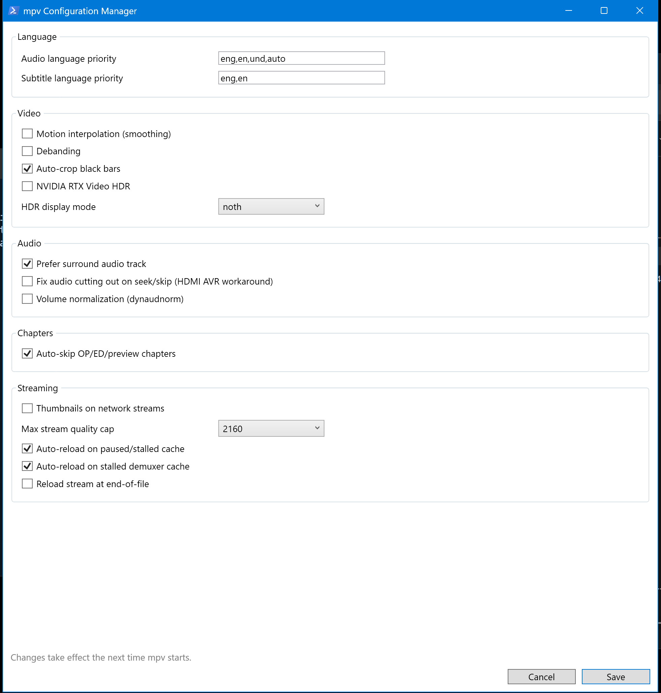

<p align="center"></p>

## 🧠 Overview

This setup is built for users who have Nvidia RTX Video Super Resolution (VSR) enabled in the Nvidia Control Panel. It includes:

- A streamlined `mpv.conf` optimized for modern GPUs
- A custom Lua script that triggers VSR after 3 seconds of playback, auto-crops black bars, and upscales to native resolution — the two are integrated in one script so crop coordinates and VSR's scale factor never disagree (see Changelog)
- Font and UI tweaks for a clean, modern look via ModernZ v0.3.3
- Fully portable structure with optional system integration
- Built-in `select.lua` UI for interactive playlist, audio, subtitle, and chapter selection

---

## 📸 Screenshots

<table>
<tr>
<td width="50%">

<p align="center"><sub><b>Player</b> — ModernZ OSC</sub></p>
</td>
<td width="50%">

<p align="center"><sub><b>Right-click menu</b></sub></p>
</td>
</tr>
<tr>
<td width="50%">

<p align="center"><sub><b>Open submenu</b> — native file/folder/URL dialogs</sub></p>
</td>
<td width="50%">

<p align="center"><sub><b>Tools submenu</b> — Clip export, hardware decoding toggle</sub></p>
</td>
</tr>
</table>

---

## ⚙️ Installation & Usage

### ✅ To install:

1. **Run `1_Full_Latest_MPV_Installer.ps1`**
   - Installs the latest versions of MPV, FFmpeg, yt-dlp, and guessit (used by `autochapters`)
   - Fully portable, no admin required

2. **Run `2_Add_Supported_Filetypes_To_Open_With.ps1`** *(optional)*
   - Adds MPV to system PATH
   - Registers MPV for "Open With" with common media formats
   - Requires admin, will auto-detect and prompt

### 🛠️ To change settings without hand-editing config files:

- **Run `3_Configuration_Manager.ps1`**
  - A small checkbox/dropdown/text panel for the settings you're most likely to actually flip — audio/subtitle language priority, interpolation, debanding, auto-crop, RTX Video HDR, HDR display mode, video sync, surround audio preference, the two opt-in audio fixes, chapter auto-skip, stream thumbnails, stream cache size, max stream quality, and the stream auto-reload triggers
  - Reads and rewrites only the specific lines it changes — every comment and every other setting in `mpv.conf`/`script-opts/*.conf` is left exactly where it was
  - No admin required. Changes take effect the next time mpv starts (this edits the files mpv reads at launch, it doesn't talk to a running mpv instance)
  - Renders in light mode regardless of system theme — it's a plain WPF window, which (unlike the native file-open dialog) doesn't auto-theme on Windows 11

  - Slightly out of date example:
  

### 🔄 To uninstall:

- **Run `X1_Remove_Supported_File_types_From_Open_With.ps1`**
  - Removes PATH entry, Open With registration, and filetype associations

### 🔁 To update:

- Simply run `1_Full_Latest_MPV_Installer.ps1`
- Updates MPV, FFmpeg, yt-dlp, and guessit
- No need to re-run registration scripts unless you've uninstalled

---

## 📁 Folder Structure

```
MPV/
├── 1_Full_Latest_MPV_Installer.ps1
├── 2_Add_Supported_Filetypes_To_Open_With.ps1          ← registration (PATH + Open With)
├── 3_Configuration_Manager.ps1                         ← checkbox/dropdown panel for common config toggles
├── X1_Remove_Supported_File_types_From_Open_With.ps1   ← uninstall (reverses script 2)
├── doc/
│   ├── manual.pdf
│   └── mpbindings.png
├── mpv/
│   └── fonts.conf
└── portable_config/
    ├── mpv.conf
    ├── input.conf
    ├── menu.conf            ← right-click context menu (mpv default + Open File/Subtitle/Audio)
    ├── fonts/               ← Netflix Sans + ModernZ icon fonts
    ├── scripts/
    │   ├── modernz.lua                   ← OSC UI
    │   ├── vsr_autocrop.lua              ← RTX VSR upscaler + crop-aware auto-crop, one integrated script (Echostorm)
    │   ├── screenshotfolder_echostorm.lua← organized screenshots (Echostorm)
    │   ├── thumbfast.lua                 ← seekbar thumbnails
    │   ├── pause_indicator_lite.lua      ← pause overlay
    │   ├── playlistmanager.lua           ← playlist OSD
    │   ├── open_file_echostorm.lua       ← native Windows open file/folder/URL/subtitle/audio dialogs (Echostorm: added folder, URL)
    │   ├── ytdlautoformat.lua            ← auto ytdl-format per domain (YouTube, Twitch, Kick)
    │   ├── chapterskip.lua               ← auto-skip OP/ED/preview chapters
    │   ├── reload.lua                    ← auto-reload stalled streams
    │   ├── hdr-mode.lua                  ← SDR/HDR auto-switch
    │   ├── display-info.dll              ← mpv-display-plugin, HDR display info for hdr-mode.lua
    │   ├── prefer_surround_echostorm.lua ← auto-selects the highest-channel-count audio track (Echostorm)
    │   ├── clip_export_echostorm.lua     ← mark in/out points, export via ffmpeg stream copy (Echostorm)
    │   ├── stream_quality_echostorm.lua  ← mid-stream quality up/down for YouTube/Twitch/Kick (Echostorm)
    │   └── autochapters/main.lua         ← auto-detect anime OP/ED chapters (needs guessit.exe, see below)
    ├── script-opts/
    │   ├── modernz.conf
    │   ├── thumbfast.conf
    │   ├── pause_indicator_lite.conf
    │   ├── playlistmanager.conf
    │   ├── ytdlautoformat.conf
    │   ├── ytdl_hook.conf                ← pins ytdl_path to yt-dlp
    │   ├── vsr_autocrop.conf
    │   ├── chapterskip.conf
    │   ├── reload.conf
    │   ├── hdr-mode.conf
    │   ├── prefer_surround_echostorm.conf
    │   ├── clip_export_echostorm.conf
    │   ├── stream_quality_echostorm.conf
    │   └── autochapters.conf
    └── shaders/
        └── cache/
```

---

## 🎯 Features

- **Configuration Manager:** `3_Configuration_Manager.ps1` — a standalone checkbox/dropdown/text panel (including audio/subtitle language priority) for the settings worth flipping without opening a config file by hand, editing only the specific lines it changes. See Installation & Usage above
- **Base UI:** ModernZ v0.3.3 with fluent icon theme
- **Fonts:** Netflix Sans Medium (default), with Light and Bold variants
- **Upscaling:** RTX VSR activates ~4 seconds after playback starts (3s hwdec settle + 1s crop detection), auto-upscales to native resolution — only applies when the *cropped* video content is below display resolution and hardware decoded (`vsr_autocrop.lua`)
- **Interactive menus:** Built-in `select.lua` (mpv 0.40+) wired to playlist, audio track, subtitle, chapter, and audio device buttons
- **Thumbnails:** thumbfast enabled including network/stream sources
- **Screenshots:** Auto-organized into `Desktop/mpv/screenshots/{title}/`, timestamped, JPG
- **Audio normalization:** `dynaudnorm` available via `af=` in `mpv.conf` (commented out by default — uncomment to enable)
- **Network buffering:** Cache and readahead configured for HLS/live stream stability
- **UI:** Borders enabled, windowed by default, taskbar progress enabled
- **File dialogs:** `Ctrl+O` opens files, `Ctrl+Shift+O` opens a folder, `Ctrl+U` opens a URL, `Ctrl+Shift+S` adds a subtitle, `Ctrl+Shift+A` adds an audio track — all via native Windows dialogs, also reachable from the right-click menu
- **Right-click menu:** mpv's full default context menu (`menu.conf`) — playback, tracks, video/audio/subtitle controls, window, tools, etc. — plus Open File/Folder/Subtitle/Audio at the top of the Open submenu, and runtime toggles for crop, auto-crop mode, chapter-skip, and HDR mode (see below)
- **Stream quality:** `ytdl-format` auto-adjusts for YouTube, Twitch, and Kick (720p cap by default), leaving other sites on `mpv.conf`'s default — pairs well with RTX VSR upscaling lower-res source. Bump it up/down mid-stream from the right-click Playback menu (`stream_quality_echostorm.lua`) — reloads at the current position with the new cap, since yt-dlp only reads `ytdl-format` at load time
- **Auto-crop:** black bars auto-detected and cropped as part of the same evaluation that decides VSR's scale factor (`vsr_autocrop.lua`, see Changelog for why these can't be separate scripts). `c` toggles/undoes the current crop+VSR state manually (`C`, uppercase, is taken by the aspect-ratio cycle); auto-crop mode itself can be toggled from the right-click `&Video` menu
- **Motion interpolation:** off by default (`interpolation=no`), toggle from the right-click `&Video` menu — smooths judder on lower-framerate content at the cost of some GPU overhead
- **Chapter skip:** opening, ending, and next-episode preview chapters auto-skipped when present — toggle from the right-click `&Chapters` menu
- **Auto chapters:** missing OP/ED chapters looked up automatically for anime files (requires `guessit.exe`, installed automatically by script 1 — or downloaded manually from [guessit-io/guessit releases](https://github.com/guessit-io/guessit/releases) and dropped in the install root; and `curl`, built into Windows 10/11) — manual search/database-update also in the right-click `&Chapters` menu
- **Stream auto-reload:** a stalled/dead network stream automatically reloads from its last position (`Ctrl+R` to trigger manually, also in the right-click Playback menu)
- **HDR:** [mpv-display-plugin](https://github.com/dyphire/mpv-display-plugin) (`scripts/display-info.dll`) provides display HDR capability info to `hdr-mode.lua`. Defaults to `hdr_mode=pass` (passes HDR through when the display is already in HDR mode; no automatic OS-level HDR switching, no flicker risk). Cycle `noth`/`switch`/`pass` from the right-click `&Window` menu
- **NVIDIA RTX Video HDR:** optional SDR→HDR enhancement, off by default (`nvidia_true_hdr=no` in `vsr_autocrop.conf`) — toggle from the right-click `&Window` menu. Only ever applies when the display is confirmed already in HDR mode (via the same `mpv-display-plugin` info `hdr-mode.lua` uses), so it can't misfire on an SDR display the way mpv's own filter can on its own (see Troubleshooting). Requires mpv 0.40+ and RTX Video HDR enabled in the NVIDIA app
- **Surround audio preferred automatically:** on file load, auto-selects whichever audio track reports the highest channel count, but only among tracks matching whatever language `alang` already resolved to — never overrides a language preference just for more channels (`prefer_surround_echostorm.lua`) — mpv's own `--aid=auto` has no channel-count preference and can land on a lesser stereo/mono track when multiple tracks are ambiguously flagged "default" in the container
- **Clip export:** mark an in/out point during playback and export that range via bundled `ffmpeg.exe` as a lossless stream-copy clip (`clip_export_echostorm.lua`), saved to `Desktop/mpv/clips/` — reachable from the right-click `Tools` → `Clip export` submenu. Cut points snap to the nearest keyframe (a stream-copy limitation, not a bug) — re-encode afterwards in a real editor if frame-accurate cuts are needed

---

## 📌 Notes

- All scripts are silent, reversible, and require no user input except to exit
- Designed for Windows 10/11 with PowerShell 3+ (written for 7)
- No registry bloat, no filetype hijacking, no start menu shortcuts
- Requires mpv 0.40+ for `select.lua` interactive menus (`load-select=yes`, mpv's actual default — `load-select-ui` was never a real option, see v1.0.3 changelog)
- RTX VSR requires `gpu-api=d3d11` and an Nvidia RTX card with VSR enabled in the Nvidia Control Panel

---

## 🔧 Troubleshooting

- **Audio cuts out, drops, or goes silent for a moment right after seeking, unpausing, or skipping to the next track/file.** Known issue with older or budget HDMI A/V receivers (AVRs) / soundbars that ignore or drop the first bit of audio every time HDMI audio output stops and restarts. Fix: uncomment `audio-stream-silence=yes` in `mpv.conf` (commented out by default since v1.0.12 — mpv's own manual calls it "strongly discouraged" since it changes A/V-sync and underrun handling for every file, so it's opt-in rather than on by default now).
- **Audio is too loud/quiet, or inconsistent between quiet and loud scenes/streams.** Uncomment `af=lavfi=[dynaudnorm=f=150:g=15:p=0.95]` in `mpv.conf` (commented out by default) — a single-pass, live-stream-safe loudness normalizer. Unlike `loudnorm`, it doesn't need to buffer the whole file first, so it's safe for live/HLS streams too.
- **Kick.com videos won't load / fail to fetch metadata.** Confirmed to be [yt-dlp#17284](https://github.com/yt-dlp/yt-dlp/issues/17284), an open upstream bug — Kick changed something site-side that broke yt-dlp's extractor (VODs, Live, and Clips all affected). Not a config issue here; should resolve itself once yt-dlp ships a fix. Re-run `1_Full_Latest_MPV_Installer.ps1` periodically to pick up new yt-dlp versions.
- **`autochapters` warns "couldn't parse media filename, is guessit installed?"** Needs `guessit.exe` in the install root — `1_Full_Latest_MPV_Installer.ps1` downloads this automatically; if you installed before that was added, just re-run the installer.
- **HDR isn't switching/passing through.** `hdr-mode.lua` needs the companion [mpv-display-plugin](https://github.com/dyphire/mpv-display-plugin) (`scripts/display-info.dll`) for display capability info — without it, `hdr_mode` has nothing to act on.
- **Enabled `nvidia_true_hdr` but nothing changes.** Needs mpv 0.40+, RTX Video HDR enabled in the NVIDIA app, an SDR (8-bit) source, and the display already in HDR mode — `vsr_autocrop.lua` checks that last part itself via `mpv-display-plugin` before applying anything, since mpv's own filter has no such check and can visibly misbehave on an SDR display ([mpv#17800](https://github.com/mpv-player/mpv/issues/17800)). If the plugin isn't installed, this option is silently a permanent no-op.
- **The Open Folder / Open URL dialogs look light-mode even in a dark theme.** Expected — both use legacy pre-Vista Windows APIs (`Shell.Application.BrowseForFolder`, VB.NET's `InputBox`) that predate dark mode and were never retrofitted for it. Open File/Add Subtitle/Add Audio use the modern dialog, which does follow system theme automatically.
- **Configuration Manager is light-mode even in a dark theme.** Same underlying reason as above, different cause: it's a plain WPF window, and WPF (unlike the modern `IFileDialog`-based open/subtitle/audio pickers) doesn't auto-theme on Windows 11 without custom styling work. Cosmetic only.
- **Changed a setting in Configuration Manager but nothing's different.** Expected if mpv was already running — it edits the config files mpv reads at launch, not a running instance. Restart mpv (or launch it fresh) to pick up the change.

---

## 📋 Changelog

Full version history moved to [CHANGELOG.md](CHANGELOG.md).

### 2026-07-31 — v1.0.19: Remove Verbose Logging, Video Sync + Stream Cache in Configuration Manager

- **Removed `log-file=~~/mpv.log`** from `mpv.conf`. This was added for active testing and forced mpv's own logging up to at least `-v -v` (mpv's documented behavior whenever `log-file` is set) — the direct cause of the 1.3MB single-session log examined earlier. Flagged in its own comment as temporary since it was added; now actually removed.
- **New Configuration Manager settings**: `video-sync` (display-resample/audio) and stream cache size (`demuxer-max-bytes`, e.g. `50MiB`) — both previously only editable by hand in `mpv.conf`.

- **New `doc/header.svg`** — a banner at the top of the README (play-icon mark, title, tagline, and RTX VSR/HDR/Portable/No Admin Required tags), colored to match ModernZ's actual accent orange (`#FF8232`, the same value as `seekbarfg_color` in `modernz.conf`) rather than an arbitrary palette.
- **Screenshots section reworked into a 2x2 grid** (HTML table, since GitHub-flavored markdown has no native side-by-side image layout) with captions, instead of four images stacked vertically.
- **All four screenshots re-cropped** to the mpv window itself — removed the desktop icons visible down the left edge and the taskbar along the bottom, both artifacts of the raw full-screen capture. Crop bounds found by sampling pixel colors at the window's edges rather than eyeballing coordinates.
