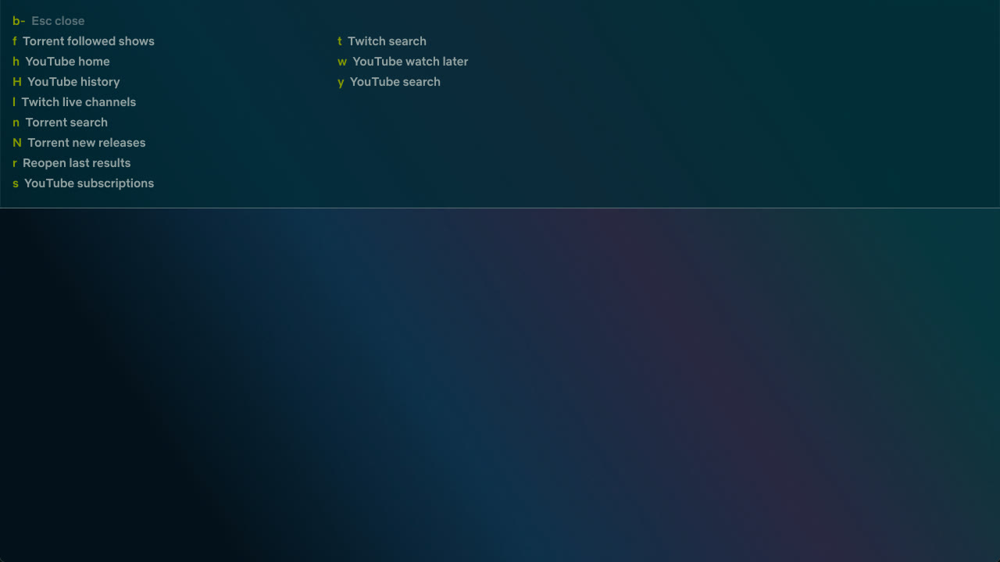
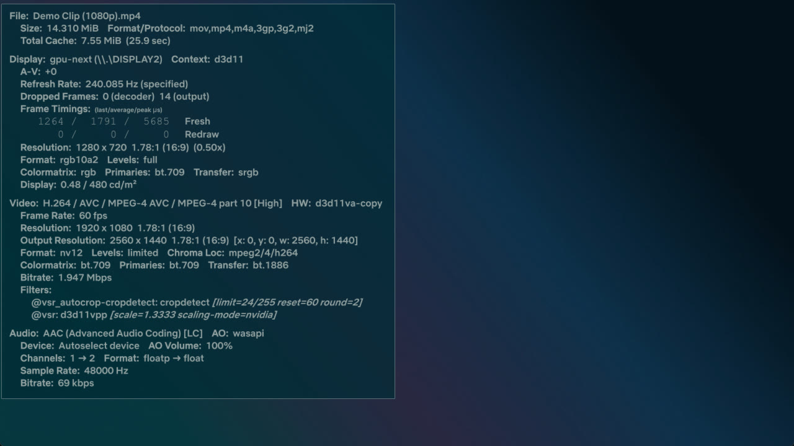

<p align="center"></p>

<p align="center">
  <a href="LICENSE"></a>
  
  
  
  <a href="CHANGELOG.md"></a>
</p>

# mpv echo-HC edition

> [!WARNING]
> **This project is vibe coded.** Most of the scripts, patches and docs were written with AI coding assistants and tested on one machine (RTX 3080 Ti, Windows 11, 240 Hz HDR). It works for me; read the code before you trust it with yours, and expect rough edges.

A fork of [Echo-Storm's MPV-Nvidia-VSR](https://github.com/Echo-Storm/MPV-Nvidia-VSR) config: portable mpv for Windows that upscales with **NVIDIA RTX Video Super Resolution**, passes **HDR** through per display, and browses **YouTube, Twitch and an anime torrent index** from inside the player. Retuned for a 240 Hz HDR display and themed **Solarized Dark** end to end.

> [!NOTE]
> RTX VSR needs an NVIDIA RTX GPU with *Video Super Resolution* turned on in the NVIDIA app. Everything else (browser, shaders, HDR, OSC) works on any GPU that runs `gpu-api=d3d11`.

<details>
<summary><b>Table of contents</b></summary>

- [Screenshots](#-screenshots)
- [Highlights](#-highlights)
- [Installation](#%EF%B8%8F-installation)
- [Updating and uninstalling](#-updating-and-uninstalling)
- [Key bindings](#%EF%B8%8F-key-bindings)
- [Features in detail](#-features-in-detail)
- [Configuration Manager](#%EF%B8%8F-configuration-manager)
- [Folder structure](#-folder-structure)
- [Troubleshooting](#-troubleshooting)
- [Documentation](#-documentation)
- [Changelog](#-changelog)
- [License](#-license)
- [Built on](#-built-on)

</details>

---

## 📸 Screenshots

<table>
<tr>
<td width="50%">

<p align="center"><sub><b>Player</b>: ModernZ OSC, Solarized gradient seekbar, thumbfast preview</sub></p>
</td>
<td width="50%">

<p align="center"><sub><b>Right-click menu</b>: <code>menu.conf</code> drawn on the OSD, Open &gt; YouTube / Twitch / Torrents</sub></p>
</td>
</tr>
<tr>
<td width="50%">

<p align="center"><sub><b>Browse</b>: YouTube search, list view (<kbd>Ctrl</kbd>+<kbd>y</kbd>)</sub></p>
</td>
<td width="50%">

<p align="center"><sub><b>Browse</b>: same results, thumbnail grid (<kbd>Tab</kbd>)</sub></p>
</td>
</tr>
<tr>
<td width="50%">

<p align="center"><sub><b>Which-key</b>: press <kbd>b</kbd> (browse) or <kbd>g</kbd> (lists) to see what follows</sub></p>
</td>
<td width="50%">

<p align="center"><sub><b>Stats</b> (<kbd>i</kbd>), on the same pane: <code>@vsr: d3d11vpp scale=1.3333 scaling-mode=nvidia</code> on a 1080p clip</sub></p>
</td>
</tr>
</table>

---

## ✨ Highlights

| | |
|---|---|
| 🔍 **RTX VSR, crop-aware** | `vsr_autocrop.lua` detects black bars, crops, then scales the *cropped* picture to the display's native resolution with RTX VSR. One script, so crop and scale factor never disagree. |
| 🌈 **HDR per display** | `hdr-mode.lua` + `mpv-display-plugin` pass HDR through on HDR monitors and inverse tone map SDR to the display's measured peak. |
| 📺 **Browse inside mpv** | YouTube search and account feeds, Twitch search and live list, and an anime torrent index of your choosing, streamed in memory. List or thumbnail grid, fuzzy filter, mouse and keyboard. |
| 🧠 **Shaders where they win** | ArtCNN, NNEDI3, RAVU, FSRCNNX, Anime4K profiles. Anime WEB-DL releases get ArtCNN automatically; VSR steps aside when a shader is active. |
| 🎨 **One theme** | Solarized Dark across ModernZ, OSD, the right-click menu, console and select menus, the stats page, the pause indicator, the browser and the which-key panel. |
| 📦 **Portable** | Everything lives in one folder. No admin needed except for the optional *Open With* registration. |

---

## ⚙️ Installation

> [!IMPORTANT]
> The scripts need Windows 10/11 and PowerShell 3+; they are written for **PowerShell 7** (`pwsh`).

1. **Download mpv, FFmpeg, yt-dlp and guessit**

   ```powershell
   .\1_Full_Latest_MPV_Installer.ps1
   ```

   Pulls the latest builds into the repo folder. Portable, no admin.

2. **Register *Open With* and `PATH`** *(optional)*

   ```powershell
   .\2_Add_Supported_Filetypes_To_Open_With.ps1
   ```

   Adds mpv to `PATH` and to *Open With* for common media types. Needs admin; the script detects this and prompts.

3. **Add login cookies** *(optional: Twitch 1440p and the YouTube account feeds)*

   `mpv.conf` points yt-dlp at `yt-dlp-cookies.txt` in the install root, next to `mpv.exe`. The file is gitignored. Without it everything still works: Twitch tops out at 1080p60 and the YouTube Subscriptions / Home / History / Watch later feeds come back empty.

   1. Install a Netscape-format cookie exporter, for example [Get cookies.txt LOCALLY](https://github.com/kairi003/Get-cookies.txt-LOCALLY).
   2. **Twitch:** logged in, in a normal window, open twitch.tv and export that site's cookies. The `auth-token` cookie does not rotate; re-export only after logging out of Twitch.
   3. **YouTube:** open a **private window**, log in, go to `https://www.youtube.com/robots.txt`, export the youtube.com cookies, then **close the private window**.
   4. Paste both exports into one `yt-dlp-cookies.txt` in the install root. yt-dlp rewrites the file after every run; that is expected.

> [!WARNING]
> YouTube rotates account cookies on open tabs. Cookies copied from your everyday browser session stop working within minutes ("The provided YouTube account cookies are no longer valid"). Use the private-window export above.

> [!CAUTION]
> Do **not** use `cookies-from-browser`. yt-dlp writes the merged jar back to the cookies file, which dumps every cookie your browser holds into plain text. See [ADR 0007](docs/adr/0007-single-cookies-file-not-cookies-from-browser.md).

4. **Point the Torrents source at an index** *(optional, for anime)*

   The repo ships no torrent site. Paste your index's two RSS URLs into `portable_config/script-opts/browse.conf`. Until both are set, *Open > Torrents* is hidden and its bindings say what to configure. `{query}` is replaced with the URL-encoded search text:

   ```ini
   torrent_search_url=https://index.example/?page=rss&q={query}&c=1_2
   torrent_new_url=https://index.example/?page=rss&c=1_2
   torrent_shows=Sousou no Frieren|SubsPlease,Dandadan
   ```

   `torrent_shows` is the follow list: comma-separated search strings, an optional `|Group` suffix keeps only that release group's uploads.

   Playback needs [Node.js](https://nodejs.org/) on `PATH` (`node --version`). The first release triggers a Windows Firewall prompt for `node.exe`. Nothing is written to disk: `script-opts/webtorrent.conf` runs the client in memory mode.

> [!TIP]
> Keep your own values out of commits with `git update-index --skip-worktree portable_config/script-opts/browse.conf`.

---

## 🔁 Updating and uninstalling

| Task | Run | Notes |
|---|---|---|
| Update mpv, FFmpeg, yt-dlp, guessit | `1_Full_Latest_MPV_Installer.ps1` | Re-run any time. Registration survives. |
| Remove *Open With* and `PATH` | `X1_Remove_Supported_File_types_From_Open_With.ps1` | Reverses script 2. Delete the folder to finish. |

---

## ⌨️ Key bindings

Two prefix keys open a **which-key** panel that lists what follows, so you do not have to memorise the rest.

| Key | Action |
|---|---|
| <kbd>b</kbd> | Browse panel: <kbd>y</kbd> YouTube search, <kbd>s</kbd> subscriptions, <kbd>h</kbd> home, <kbd>H</kbd> history, <kbd>w</kbd> watch later, <kbd>t</kbd> Twitch search, <kbd>l</kbd> Twitch live, <kbd>n</kbd> / <kbd>N</kbd> / <kbd>f</kbd> torrent search / new / followed, <kbd>r</kbd> reopen |
| <kbd>g</kbd> | Lists panel (`select.lua`): <kbd>p</kbd> playlist, <kbd>a</kbd> audio, <kbd>s</kbd> subtitles, <kbd>c</kbd> chapters, <kbd>d</kbd> audio devices, <kbd>h</kbd> watch history, <kbd>b</kbd> all bindings, <kbd>g</kbd> reload subtitles |
| <kbd>Ctrl</kbd>+<kbd>y</kbd> / <kbd>Ctrl</kbd>+<kbd>t</kbd> / <kbd>Ctrl</kbd>+<kbd>n</kbd> | Search YouTube / Twitch / the torrent index |
| <kbd>Ctrl</kbd>+<kbd>b</kbd> | Reopen the last browse results without refetching |
| <kbd>Ctrl</kbd>+<kbd>Shift</kbd>+<kbd>t</kbd> | Torrent transfer overlay (speed, peers, progress) |
| <kbd>Ctrl</kbd>+<kbd>o</kbd> / <kbd>Ctrl</kbd>+<kbd>Shift</kbd>+<kbd>o</kbd> / <kbd>Ctrl</kbd>+<kbd>u</kbd> | Open file / folder / URL (native Windows dialogs) |
| <kbd>Ctrl</kbd>+<kbd>Shift</kbd>+<kbd>s</kbd> / <kbd>Ctrl</kbd>+<kbd>Shift</kbd>+<kbd>a</kbd> | Add subtitle / audio track |
| <kbd>c</kbd> | Toggle or undo the current crop + VSR state |
| <kbd>C</kbd> | Cycle aspect ratio |
| <kbd>d</kbd> / <kbd>D</kbd> | Toggle debanding / deinterlacing |
| <kbd>Ctrl</kbd>+<kbd>d</kbd> | Detect interlacing and insert a deinterlacer (`autodeint.lua`) |
| <kbd>Ctrl</kbd>+<kbd>r</kbd> | Reload a stalled stream at the current position |
| <kbd>k</kbd> | Always on top |
| <kbd>i</kbd> / <kbd>I</kbd> | Stats once / toggle |
| Hold <kbd>→</kbd> | Fast-forward (`evafast.lua`); tap to seek |
| Right-click | Full menu: Open, Playlist, Tracks, Playback, Chapters, Video, Audio, Subtitle, Window, View, Profiles, Tools |

**Inside the browser:** type to fuzzy-filter, <kbd>↑</kbd> <kbd>↓</kbd> <kbd>PgUp</kbd> <kbd>PgDn</kbd> <kbd>Home</kbd> <kbd>End</kbd> or the wheel to move, hover to focus, <kbd>Enter</kbd> or click to play, <kbd>Shift</kbd>+<kbd>Enter</kbd> to queue, <kbd>Tab</kbd> for list / grid, <kbd>Esc</kbd> clears the filter, then closes.

The complete list is in `portable_config/input.conf`, or press <kbd>g</kbd> <kbd>b</kbd> in the player.

---

## 🎯 Features in detail

<details open>
<summary><b>📺 Browser: YouTube, Twitch, torrents</b></summary>

- **YouTube:** search plus your Subscriptions, Home, History and Watch later feeds (feeds need cookies, Installation step 3). Played videos are marked watched on your account when cookies are present.
- **Twitch:** channel search and a live list, sorted by viewers, with uptime and compact viewer counts. Twitch does not give third-party clients the follow list, so *Live channels* checks the logins you put in `script-opts/browse.conf` under `twitch_channels=` ([ADR 0008](docs/adr/0008-twitch-follows-from-hand-maintained-list.md)).
- **Torrents:** *Open > Torrents* (Search..., New releases, Followed shows) reads the RSS feeds you configured. Releases are grouped by show, newest episode first, then highest resolution, then most seeders. Rows show `[Group] Show  S2 E07  1080p`, with fansub episode numbers resolved to TVDB season/episode through [Fribb/anime-lists](https://github.com/Fribb/anime-lists) and [anime-relations](https://github.com/erengy/anime-relations). Seeders, size and a `trusted` marker are shown; releases under 3 seeders are dimmed and sink to the bottom of their show. The grid shows one AniList cover per show.
- **Streaming:** <kbd>Enter</kbd> hands the release to `webtorrent.js`, which streams it in memory. A season batch loads as a playlist. Picking another release stops the first transfer.
- **Views:** Solarized Dark list (18 rows) or a 4x3 thumbnail grid, <kbd>Tab</kbd> toggles. Results reopen without refetching (<kbd>Ctrl</kbd>+<kbd>b</kbd>), and each source remembers its last search text.

</details>

<details>
<summary><b>🔍 Upscaling, cropping and shaders</b></summary>

- **RTX VSR** starts about 4 seconds into playback (3 s hardware-decode settle, 1 s crop detection) and scales to native resolution. It only applies when the *cropped* picture is below display resolution and hardware decoded. Crop detection retries at 4 / 20 / 65 / 185 s without dropping frames.
- **Auto-crop** runs in the same evaluation that picks VSR's scale factor, so the two cannot be separate scripts. <kbd>c</kbd> toggles manually; auto-crop mode itself is in the right-click *Video* menu.
- **Shaders:** `profiles.conf` ships `ArtCNN`, `ArtCNN-DS`, `NNEDI3`, `NNEDI3+`, `Ravu-Zoom`, `FSRCNNX`, `FSRCNNX+`, `Anime4K` and two deband strengths, selectable with `--profile=` or right-click *Profiles*. SubsPlease, Erai-raws, HorribleSubs and HatSubs files get `ArtCNN_C4F16_DS` automatically.
- **Shaders and VSR do not stack.** d3d11's video processor scales before any shader runs, so `vsr_autocrop.lua` skips VSR when a shader is set. Measurements in [`doc/research-rtx-vsr-vs-shaders.md`](doc/research-rtx-vsr-vs-shaders.md).
- Only the ArtCNN **C4F16** builds work on `gpu-api=d3d11`. C4F32 and the `_CMP` compute builds exceed d3d11's constant-buffer and shared-memory limits and are silently disabled ([ADR 0003](docs/adr/0003-artcnn-c4f16-only-on-d3d11.md)).

</details>

<details>
<summary><b>🌈 HDR</b></summary>

- [mpv-display-plugin](https://github.com/dyphire/mpv-display-plugin) (`scripts/display-info.dll`) tells `hdr-mode.lua` what each display can do.
- Default `hdr_mode=pass`: HDR is passed through when Windows HDR is already on. No OS-level switching, no flicker. Cycle `noth` / `switch` / `pass` from the right-click *Window* menu.
- In pass mode, SDR sources are inverse tone mapped by libplacebo to the display's measured peak (`inverse-tone-mapping=yes`).
- **NVIDIA RTX Video HDR** is optional and off (`nvidia_true_hdr=no` in `vsr_autocrop.conf`). When enabled, it only applies if the display is confirmed to be in HDR mode, so it cannot misfire on SDR ([ADR 0006](docs/adr/0006-sdr-to-hdr-via-libplacebo-not-rtx-video-hdr.md)).

</details>

<details>
<summary><b>🎨 Interface</b></summary>

- **ModernZ v0.3.3** with the fluent icon theme is the only OSC ([why not uosc](doc/research-osc-modernz-vs-uosc.md)). A local patch adds `seekbar_shimmer`: the progress bar is an animated blue → cyan → green gradient (`modernz.conf`).
- **Solarized Dark** everywhere: ModernZ, OSD messages, the right-click menu, console and `select.lua` menus, the pause indicator, the browser, the which-key panel and the stats page share one translucency level and a thin base01 edge. Stats uses a patched local copy of mpv's `stats.lua` (`scripts/stats.lua`, re-sync steps in `docs/testing.md`).
- **Which-key panel** (`whichkey.lua`): press a prefix key and see its bindings.
- **Thumbnails** on the seekbar for local files and streams, YouTube and Twitch VODs included (thumbfast).
- **Right-click menu:** mpv's OSD-drawn context menu (`load-context-menu=yes`, styled in `script-opts/context_menu.conf`) over `menu.conf`, extended with Open File / Folder / URL / Subtitle / Audio, the browser sources, stream quality up / down, and runtime toggles for crop, auto-crop mode, chapter skip, interpolation and HDR mode.
- **Fonts:** Netflix Sans (Light, Medium, Bold).

</details>

<details>
<summary><b>🔊 Audio</b></summary>

- **Surround preferred:** `prefer_surround_echostorm.lua` picks the track with the most channels, but only among tracks in the language `alang` already chose.
- **Downmix profiles** keep 5.1(side) surrounds and only fire on stereo output.
- **Loudness normalisation:** `dynaudnorm` is in `mpv.conf`, commented out. Single-pass, safe for live streams.

</details>

<details>
<summary><b>📡 Streams and playback</b></summary>

- **Stream quality:** `ytdlautoformat.lua` caps YouTube, Twitch and Kick at 2160p by default (`quality=` in `ytdlautoformat.conf`). Step up or down mid-stream from the right-click *Playback* menu; it reloads at the current position.
- **Auto-reload** of stalled streams from their last position (`reload.lua`).
- **Chapters:** OP / ED / preview chapters are skipped (`chapterskip.lua`, toggle in *Chapters*). Missing anime OP / ED chapters are looked up automatically (`autochapters`, needs `guessit.exe`, installed by script 1).
- **Watch history:** mpv's built-in `save-watch-history`, browsable with <kbd>g</kbd> <kbd>h</kbd>.
- **Clip export:** mark in / out and export a lossless stream-copy clip with the bundled `ffmpeg.exe` to `Desktop/mpv/clips/` (*Tools > Clip export*). Cuts snap to keyframes.
- **Screenshots** go to `Desktop/mpv/screenshots/{title}/`, timestamped JPG.
- **`video-sync=audio`**: every display-sync mode dropped frames on 4K HDR at 240 Hz in testing; audio sync dropped none ([ADR 0001](docs/adr/0001-video-sync-audio-not-display-resample.md)).

</details>

---

## 🛠️ Configuration Manager

```powershell
.\3_Configuration_Manager.ps1
```

A small WPF panel for the settings worth flipping without opening a config file: audio / subtitle language priority, interpolation, debanding, auto-crop, RTX Video HDR, HDR display mode, video sync, surround preference, the two opt-in audio fixes, chapter skip, stream thumbnails, stream cache size, max stream quality and the stream auto-reload triggers.

<p align="center"></p>

- Rewrites only the lines it changes. Comments and every other setting in `mpv.conf` and `script-opts/*.conf` stay where they were.
- Changes apply the next time mpv starts; it edits files, it does not talk to a running player.
- Always light mode: plain WPF does not follow the Windows 11 theme.

---

## 📁 Folder structure

<details>
<summary>Expand</summary>

```text
MPV/
├── 1_Full_Latest_MPV_Installer.ps1                     ← downloads mpv, ffmpeg, yt-dlp, guessit into this folder
├── 2_Add_Supported_Filetypes_To_Open_With.ps1          ← registration (PATH + Open With)
├── 3_Configuration_Manager.ps1                         ← checkbox/dropdown panel for common config toggles
├── X1_Remove_Supported_File_types_From_Open_With.ps1   ← uninstall (reverses script 2)
├── yt-dlp-cookies.txt                                  ← your login cookies, gitignored (Installation step 3)
├── doc/                                                ← screenshots, banner, manual.pdf, research notes
├── docs/
│   ├── adr/                                            ← decision records (why things are the way they are)
│   ├── tests/                                          ← Lua and shell tests, run under mpv
│   └── testing.md                                      ← how to verify changes: synthetic clips, probes, UI driving
├── webtorrent/                                         ← bun project vendoring webtorrent-mpv-hook (+ patch)
└── portable_config/
    ├── mpv.conf
    ├── profiles.conf        ← shader, HDR, downscaling and downmix profiles
    ├── input.conf           ← key bindings, including the g and b which-key prefixes
    ├── menu.conf            ← right-click context menu
    ├── fonts/               ← Netflix Sans + ModernZ icon fonts
    ├── scripts/
    │   ├── browse.lua                    ← YouTube / Twitch / torrent-index browser
    │   ├── browse_torrents.lua           ← RSS parsing and release ordering for the Torrents source
    │   ├── browse_anime.lua              ← fansub episode → TVDB S##E## resolution
    │   ├── whichkey.lua                  ← prefix-key panel
    │   ├── modernz.lua                   ← OSC (local patch: seekbar_shimmer)
    │   ├── vsr_autocrop.lua              ← RTX VSR + crop-aware auto-crop (Echostorm)
    │   ├── thumbfast.lua                 ← seekbar thumbnails
    │   ├── stats.lua                     ← mpv's stats page, local copy drawn on the Solarized pane
    │   ├── hdr-mode.lua                  ← per-display HDR target, SDR→HDR inverse tone mapping
    │   ├── display-info.dll              ← mpv-display-plugin, HDR display info for hdr-mode.lua
    │   ├── webtorrent.js                 ← webtorrent-mpv-hook, streams torrents in memory (needs node)
    │   ├── autochapters/main.lua         ← anime OP/ED chapter lookup (needs guessit.exe)
    │   ├── open_file_echostorm.lua       ← native Windows open file/folder/URL/subtitle/audio dialogs
    │   ├── stream_quality_echostorm.lua  ← mid-stream quality up/down
    │   ├── clip_export_echostorm.lua     ← in/out marks, ffmpeg stream-copy export
    │   ├── prefer_surround_echostorm.lua ← highest-channel audio track within the chosen language
    │   ├── screenshotfolder_echostorm.lua← organised screenshots
    │   ├── ytdlautoformat.lua            ← ytdl-format per site
    │   ├── chapterskip.lua, reload.lua, autoload.lua, autodeint.lua, evafast.lua, pause_indicator_lite.lua
    ├── script-opts/                      ← one .conf per script
    └── shaders/                          ← ArtCNN C4F16, NNEDI3, RAVU, FSRCNNX, Anime4K, SSIM (d3d11-compatible builds only)
```

</details>

---

## 🔧 Troubleshooting

<details>
<summary><b>Twitch plays at 1080p, not 1440p</b></summary>

Twitch only serves the 1440p60 *Source* rendition to logged-in accounts. Either `yt-dlp-cookies.txt` is missing, or you logged out of Twitch in the browser and the `auth-token` died with the session. Re-export the twitch.tv cookies (Installation step 3). To check:

```powershell
.\yt-dlp.exe --cookies yt-dlp-cookies.txt -F https://twitch.tv/<channel>   # should list a 2560x1440 HEVC format
```

</details>

<details>
<summary><b>YouTube feeds are empty, or "cookies are no longer valid"</b></summary>

The YouTube cookies came from a live browser session and were rotated. Re-export them from a fresh private window on `youtube.com/robots.txt` and close that window before playing anything (Installation step 3).
</details>

<details>
<summary><b>Twitch <i>Live channels</i> shows nobody</b></summary>

Twitch's GraphQL API answers "service error" to third-party clients asking for the follow list. Fill `twitch_channels=` in `script-opts/browse.conf` with the logins you care about, comma-separated.
</details>

<details>
<summary><b><i>Open > Torrents</i> is missing, or a binding says "set torrent_search_url="</b></summary>

Both index URLs in `script-opts/browse.conf` are empty (Installation step 4). "index feed failed" with a curl message means the index did not answer; "index did not return an RSS feed" means the URL is a web page, not its RSS variant.
</details>

<details>
<summary><b>A release shows a black window and never plays</b></summary>

The log says `Running WebTorrent hook` and then nothing: no peers were found (check the seeder count, try a `trusted` release), or `node.exe` is missing from `PATH` or blocked by the firewall. <kbd>Ctrl</kbd>+<kbd>Shift</kbd>+<kbd>t</kbd> shows peers and speed while it buffers.
</details>

<details>
<summary><b>A shader profile does nothing, or the log says <code>Too many constant buffers</code></b></summary>

Only ArtCNN C4F16 builds work on `gpu-api=d3d11`. Do not add C4F32 or `_CMP` builds unless you switch to `gpu-api=vulkan`, which loses RTX VSR.
</details>

<details>
<summary><b>4K HDR stutters or drops frames at high refresh rates</b></summary>

Make sure `video-sync=audio` is still set (the Configuration Manager can switch it). `display-resample` measurably dropped frames on 2160p HDR at 240 Hz.
</details>

<details>
<summary><b>HDR is not passing through / RTX Video HDR does nothing</b></summary>

`hdr-mode.lua` needs `scripts/display-info.dll` ([mpv-display-plugin](https://github.com/dyphire/mpv-display-plugin)). RTX Video HDR additionally needs mpv 0.40+, RTX Video HDR enabled in the NVIDIA app, an 8-bit SDR source, and the display already in HDR mode. Without the plugin, `nvidia_true_hdr` is a permanent no-op.
</details>

<details>
<summary><b>Audio drops for a moment after seeking, unpausing or changing files</b></summary>

Common with HDMI receivers and soundbars that drop the first bit of audio when the stream restarts. Uncomment `audio-stream-silence=yes` in `mpv.conf`. It is opt-in because mpv's manual discourages it: it changes A/V sync and underrun handling for every file.
</details>

<details>
<summary><b>Loudness jumps between scenes or streams</b></summary>

Uncomment `af=lavfi=[dynaudnorm=f=150:g=15:p=0.95]` in `mpv.conf`. Unlike `loudnorm`, it does not buffer the whole file, so it is safe for live streams.
</details>

<details>
<summary><b>Kick videos will not load</b></summary>

Upstream yt-dlp bug, [yt-dlp#17284](https://github.com/yt-dlp/yt-dlp/issues/17284). Re-run `1_Full_Latest_MPV_Installer.ps1` periodically to pick up the fix.
</details>

<details>
<summary><b><code>autochapters</code> warns "is guessit installed?"</b></summary>

`guessit.exe` must be in the install root. Script 1 downloads it; re-run it if you installed before that was added.
</details>

<details>
<summary><b>Open Folder / Open URL dialogs or the Configuration Manager are light mode</b></summary>

Expected. Those dialogs use pre-Vista Windows APIs, and plain WPF does not follow the Windows 11 theme. Open File / Add Subtitle / Add Audio use the modern dialog and do follow it.
</details>

<details>
<summary><b>Changed a setting in the Configuration Manager and nothing changed</b></summary>

It edits the files mpv reads at launch. Restart mpv.
</details>

---

## 📚 Documentation

| Where | What |
|---|---|
| [`CHANGELOG.md`](CHANGELOG.md) | Every version, newest first |
| [`CONTEXT.md`](CONTEXT.md) | Glossary of the project's terms |
| [`docs/adr/`](docs/adr/) | Architecture decision records |
| [`docs/testing.md`](docs/testing.md) | Synthetic test clips, probes, how to drive the UI from a script, the test suite |
| [`doc/research-rtx-vsr-vs-shaders.md`](doc/research-rtx-vsr-vs-shaders.md) | Why shaders and VSR cannot stack, with measurements |
| [`doc/research-osc-modernz-vs-uosc.md`](doc/research-osc-modernz-vs-uosc.md) | Why ModernZ is the only OSC |
| `doc/manual.pdf`, `doc/mpbindings.png` | mpv manual and default binding chart |

Issues and requests: [GitHub Issues](https://github.com/samkovacs/mpv-echo-hc/issues).

---

## 📋 Changelog

Full history in [CHANGELOG.md](CHANGELOG.md). Latest:

### 2026-09-23 — echo-HC v0.04: Solarized Dark, which-key, browser polish

- **Solarized Dark theme** across ModernZ, OSD, the right-click menu, console / select menus, the stats page and the pause indicator; ModernZ patch for an animated gradient seekbar.
- **`whichkey.lua`**: <kbd>g</kbd> and <kbd>b</kbd> prefix panels.
- **Browser**: reopen last results, <kbd>Shift</kbd>+<kbd>Enter</kbd> queues, per-source search memory, Twitch live sorted by viewers with uptime; torrent rows show resolved `S##E##` and AniList covers per show.
- **Fixes**: thumbfast thumbnails for YouTube and cropped Twitch VODs, no VO rebuild at HDR start, crop-detect retries no longer drop frames, `autodeint` ordering before VSR.

---

## 📄 License

[MIT](LICENSE). Bundled third-party scripts, shaders and fonts keep their own licenses.

---

## 🙏 Built on

This is a config, not a player. Everything good here comes from these projects; go star them.

| Project | What it brings |
|---|---|
| [**mpv**](https://github.com/mpv-player/mpv) | The player itself, plus its `select.lua`, `console.lua`, `stats.lua`, `autoload.lua` and `autodeint.lua` |
| [**Echo-Storm/MPV-Nvidia-VSR**](https://github.com/Echo-Storm/MPV-Nvidia-VSR) | The upstream this is forked from: the portable layout, installer scripts, Configuration Manager, `vsr_autocrop.lua` and every `*_echostorm` script |
| [**Samillion/ModernZ**](https://github.com/Samillion/ModernZ) | The OSC, the pause indicator and the open-file dialog extras |
| [**Samillion/mpv-ytdlautoformat**](https://github.com/Samillion/mpv-ytdlautoformat) | Per-site `ytdl-format` |
| [**rossy/mpv-open-file-dialog**](https://github.com/rossy/mpv-open-file-dialog) | The original native Windows open-file dialog |
| [**po5/thumbfast**](https://github.com/po5/thumbfast) | Seekbar thumbnails |
| [**po5/evafast**](https://github.com/po5/evafast) | Hold-to-fast-forward |
| [**po5/chapterskip**](https://github.com/po5/chapterskip) | OP / ED / preview chapter skipping |
| [**po5/mpv-auto-chapters**](https://github.com/po5/mpv-auto-chapters) | Anime OP / ED chapter lookup |
| [**4e6/mpv-reload**](https://github.com/4e6/mpv-reload) | Auto-reload of stalled streams |
| [**dyphire/mpv-display-plugin**](https://github.com/dyphire/mpv-display-plugin) | Display HDR capability info (`display-info.dll`) |
| [**dyphire/mpv-scripts**](https://github.com/dyphire/mpv-scripts) | `hdr-mode.lua` |
| [**mrxdst/webtorrent-mpv-hook**](https://github.com/mrxdst/webtorrent-mpv-hook) | In-memory torrent streaming |
| [**yt-dlp**](https://github.com/yt-dlp/yt-dlp), [**FFmpeg**](https://ffmpeg.org/), [**guessit**](https://github.com/guessit-io/guessit) | Streams, thumbnails and clip export, filename parsing |
| [**Artoriuz/ArtCNN**](https://github.com/Artoriuz/ArtCNN), [**bloc97/Anime4K**](https://github.com/bloc97/Anime4K), [**bjin/mpv-prescalers**](https://github.com/bjin/mpv-prescalers), [**igv/FSRCNN-TensorFlow**](https://github.com/igv/FSRCNN-TensorFlow) | Shaders (ArtCNN, Anime4K, NNEDI3 / RAVU, FSRCNNX) |
| [**AniList**](https://anilist.co/), [**Fribb/anime-lists**](https://github.com/Fribb/anime-lists), [**erengy/anime-relations**](https://github.com/erengy/anime-relations) | Covers and anime episode numbering |
| [**Solarized**](https://ethanschoonover.com/solarized/) by Ethan Schoonover | The colour palette |
